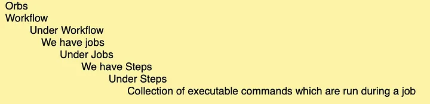

## Circle-ci 

Pipeline: Represents the entirety of the configuration. Available in CircleCI Cloud only.
Workflows: Responsible for organizing multiple jobs.
Jobs: Responsible for running a series of steps that perform commands.
Steps: Run commands (such as installing dependencies or running tests) and shell scripts to do the work7.Investigate the steps of our job

What are obs
CircleCI orbs are shareable packages of configuration elements, including jobs, commands, and executors.

Use orbs to reduce configuration complexity and help you integrate with your software and services stack quickly and easily across many projects.

ref: https://circleci.com/docs/configuration-reference/

dash: https://app.circleci.com/pipelines/circleci/VD7yGLJB1nhvtiFwMqDwVn/DDamVhrev1HzZqt6u4KqQJ

Base: https://github.com/cypress-io/cypress-realworld-app/blob/develop/.circleci/config.yml#L240

project: https://gitlab.com/raphaelpalhano/circle_ci_cypress/
